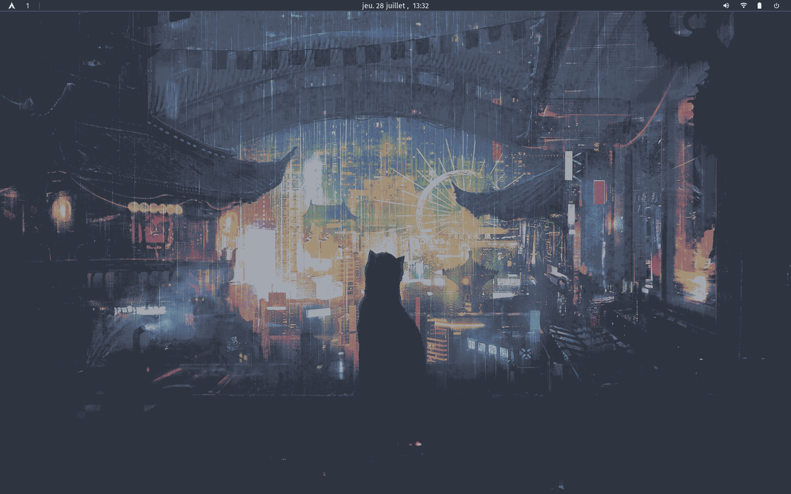
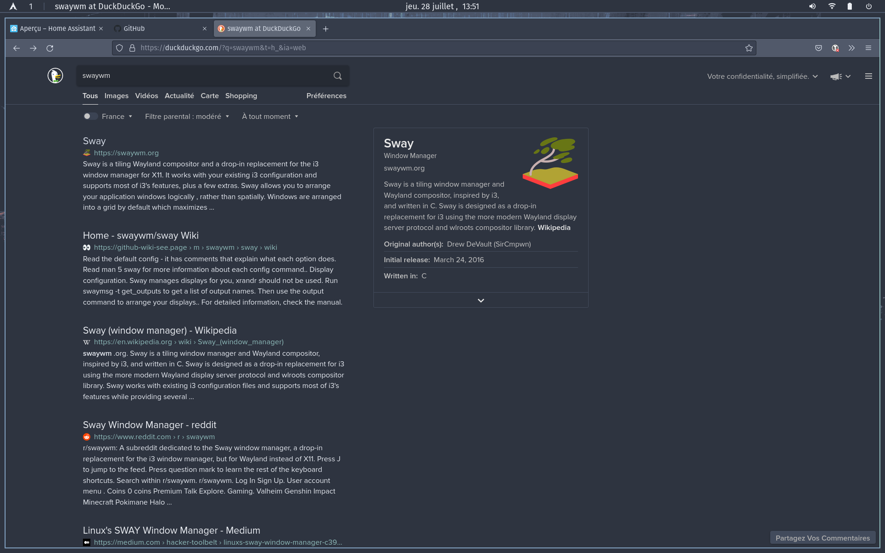
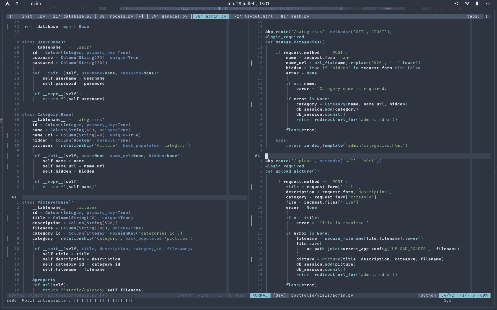
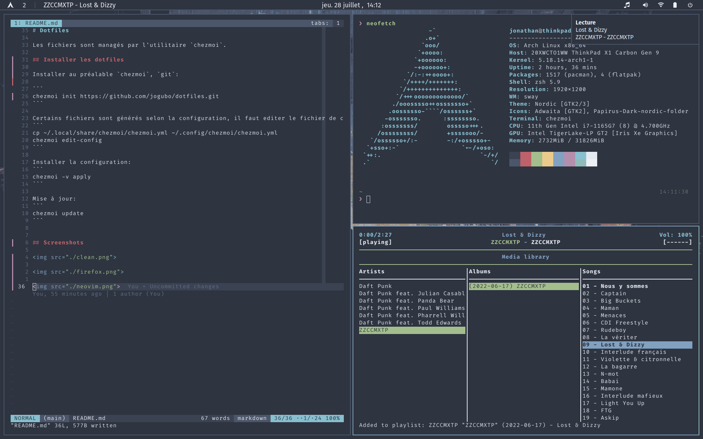

# Dotfiles

Les fichiers sont managés par l'utilitaire `chezmoi`.

## Installer les dotfiles

Installer au préalable `chezmoi`, `git`:

```
chezmoi init https://github.com/jogubo/dotfiles.git
```

Certains fichiers sont générés selon la configuration, il faut editer le fichier de config:
```
cp ~/.local/share/chezmoi/chezmoi.yml ~/.config/chezmoi/chezmoi.yml
chezmoi edit-config
```

Installer la configuration:
```
chezmoi -v apply
```

Mise à jour:
```
chezmoi update
```


## Screenshots










#### Wallpaper

*Source:* Tears in The Rain - Daniel Lang

Utilisation de ImageGoNord pour modifier la palette de couleurs.
